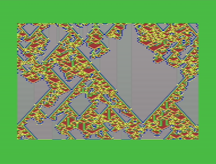

# One Dimensional Cellular Automata on the Commodore 64



## Overview

What is a one dimensional cellular automata? It's a way of generating patterns with some interesting properties, from simple starting conditions. Stephen Wolfram in his book [A new Kind of Science](https://en.wikipedia.org/wiki/A_New_Kind_of_Science) both describes and studies the properties of these simple systems, and whilst he gets a little carried away about how exactly important it all is there is no doubt that these are very interesting. When they built a new railway station in Cambridge in 2017 they clad the [outside in Rule 30](https://qz.com/1001946/a-uk-train-stations-tribute-to-a-famous-mathematician-got-everything-right-except-his-math), which might be as real world useful as it gets. For me since about 1985 its been a way of getting computers to do something visually interesting. It lends itself nicely to a machine coded implemention has been my goto `HelloWorld` when finding my way around a new system. Over the years I've implemented it on BBC Micro, Amiga, VIC 20, Archimedies, Raspberry PI, Raspberry PI Pico and Javascript. If its got 4 colours and pixels its fair game.

The classic CA ([Cellular Automata](https://en.wikipedia.org/wiki/Elementary_cellular_automaton)), as described by Wolfram has simple binary cells containg a 0 or 1. However I have always favoured 2 bit cells (0,1,2 and 3), which can be represented with four different colours rather than the black and white of pure binary cells. That's what I'm using here taking advantage of the C64 Multicolour hi-resolution mode.

## How to use


Use the left and right cursor keys to move between boxes in the GUI. A grey help text area at the bottom left of the screen shows you which keys you can use, with global keys that can be pressed at anytime picked out in reversed white. There is a bank of 16 rules a few of which I've preset. I've set my VICE emulator to have a virtual drive 9, and this can be used to save and load the rule bank. Up and down cursor keys on the IND box change which of the 16 slots is currently being used. The ten digit number is the rule, and the keys 0-9 will cycle through the cell values 0-3 for each digit. Or you can press R to set random rule mode, and get a fresh rule each time.
I've picked four colours that seem to work well, but you are of course free to pick any of the 16 available, but you should have 4 different ones or else you'll loose some of the pattern.

Pressing Return on the RUN box will display the automata. The RUN STOP key (ESC in VICE), will bring you back to the GUI. Once the automata has rendered you can press return again to get a fresh row of random cells with the current rule, or press SPACE to scroll up 8 lines of the current view. There is a auto scroll mode, but its a bit ropey right now. Very happy if you can do better.

## How does it work?

There are two main parts to a CA, the **cells** and a **rule**.

In one dimensional CA the cells can be represented as a buffer or array of values, and in ths case each cell can have a value from 0 to 3. In the case of the C64 we need 160 cells per horizontal line. The cells are initialised randomly and the buffer is treated as being wrapped, that is the last cell is treated as being next the first. So more of a circle of 160 cells than a line.

The rule is applied to give the next generation, which is then plotted on the display in the line below, and so on till the bottom of the screen is reached.

The rule is itself an array of ten cells each holding a value between 0 and 3. To apply the rule we take a cell in the current generation, say at index _i_ and the cells before and after it, and sum their values together.

```
initialise cellA with random values
do {
    plot cellA to display
    move down screen
    if at bottom then exit
    for i = 0 to cellA.length {
        n = cellA[i] + cellA[i-1] + cellA[i+1]
        cellB[i] = rule[n]
    }
    swap cellB to cellA
} repeat
```

This will give us a result between 0 and 9, depending on the values of the three cells. Take this value and index into our rule to pull out the value there, then insert into the next generation at the corresponding index _i_. There is a little bit of stuff to do at the first and last cells to effect the wrap, but that really is all there is to it.

## Development

I used Visual Studio with the VS64 plugin, Kick assembler and VICE C64 emulator. In the VS64 plugin settings I added in a virtual Drive 9 floppy by setting the Vice Args to

```
-drive9type 1542 -9 <fullpath>/drive9.d64
```

You can use the drive9.d64 disk image file provided here. You'll also find you can mount the file by menuing over it in VS Code.

Kick assembler is the most useful 6502 assembler I've found so far. Its implemented in Java so follow teh docs linked below to find out how to install it.

The GUI uses a list of object like boxes each having some standard methods and data fields for rendering and key handling, as well as standard states like selection and marking as edited. There are some dirty bits in there like copying the object to a fixed place in memory to make addressing it easier, but its assemlber so hey ho.

### Future plans

* With 6 bytes spare per rule, there is space in the rule bank to add in the colours being used.

* Try and get the scrolling to be less awful.

* Show a preview of the automata in the GUI using multicolour sprites.

### Links

- The VS64 plugin for Visual Studio: https://github.com/rolandshacks/vs64
- The Kick Assembler: http://theweb.dk/KickAssembler
- VICE, the Versatile Commodore Emulator: http://vice-emu.sourceforge.net
